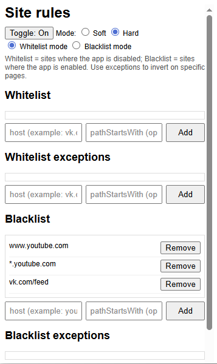

# carrot-and-stick
### This browser extension will help you add a sound "punishment" for mindlessly scrolling through social media feeds and video hosting sites.

Installation instruction in Edge.

Extension window.

After installing and configuring black sites, you will start to hear gently annoying sounds when scrolling and clicking.

#### Update 20.11.2025. Add __hard/soft modes__

Soft and hard modes determine how the visual effect works on resources under the imposed restriction. For the hard mode, the blocked page is under an ongoing visual effect. Only a click or scrolling can remove this effect.
In the soft mode, on the contrary, the effect is applied only when scrolling and clicking.

